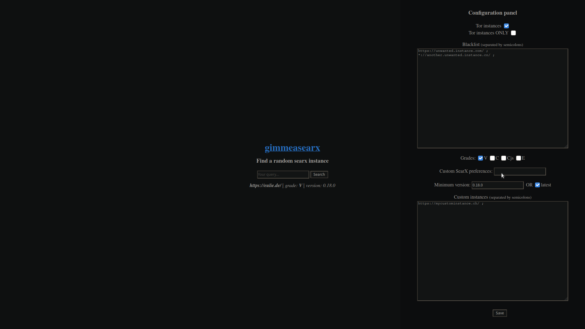

# gimmeasearx

Configurable, JavaScript-less Neocities alternative, written in Go!
It gives you a random searx (privacy-respecting metasearch engine) instance each time you visit the page.
You can either clone, build and use it locally using techniques below or use the Tor [hidden service](http://7tcuoi57curagdk7nsvmzedcxgwlrq2d6jach4ksa3vj72uxrzadmqqd.onion/). There's also [a wiki](https://github.com/demostanis/gimmeasearx/wiki)!



## Running
You will need `git` and `go`. Once setup, run the following commands:
```sh
git clone https://github.com/demostanis/gimmeasearx.git
go run gimmeasearx.go 
```
That's it! Open up a browser and check [localhost:8080](http://localhost:8080).

If you want .onion instances to show up, you need [Tor](https://www.torproject.org/) installed and running.

For more ways to run gimmeasearx, such as with Docker or through a systemd service, check the [wiki page](https://github.com/demostanis/gimmeasearx/wiki/Running).

--------

Licensed under GPLv3.

If my time spent coding this was helpful to you,
I'd be gladful to receive donations:

- Ethereum: **0xF239e7C7b1C75EFF467EE4b74CEB4002E3d00BEE**

- Bitcoin: **5cc720fb7ca0bf0807e0223946fae738**

