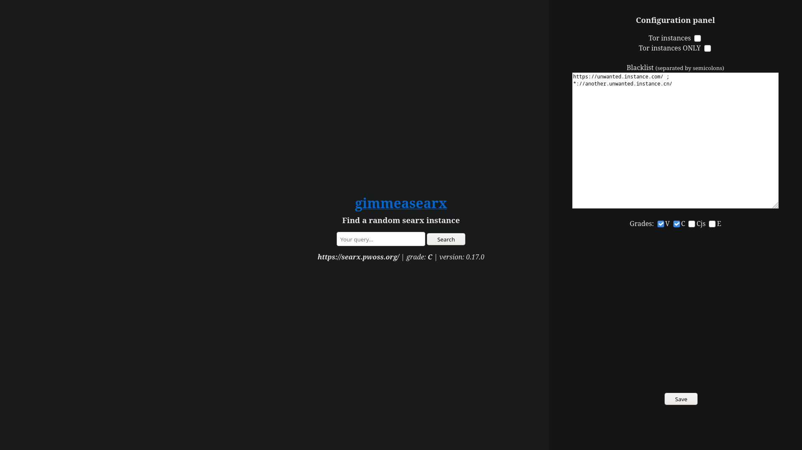

# gimmeasearx

Configurable, JavaScript-less Neocities alternative, written in Go!
It gives you a random searx (privacy-respecting metasearch engine) instance each time you visit the page.
You can either clone, build and use it locally or use the Tor [hidden service](http://7tcuoi57curagdk7nsvmzedcxgwlrq2d6jach4ksa3vj72uxrzadmqqd.onion/).



## Run with Golang
You will need `git` and `go`. Once setup, run the following commands:
```sh
git clone https://github.com/demostanis/gimmeasearx.git
go run cmd/main.go
```
That's it! Open up a browser and check [localhost:8080](http://localhost:8080).

## Docker

```sh
docker build -t gimmeasearx .
docker run --name gimmesearx -d -ti -p 8080:8080 gimmeasearx
```

The docker instance should be running and you can access it via [localhost:8080](http://localhost:8080).

Licensed under GPLv3.
